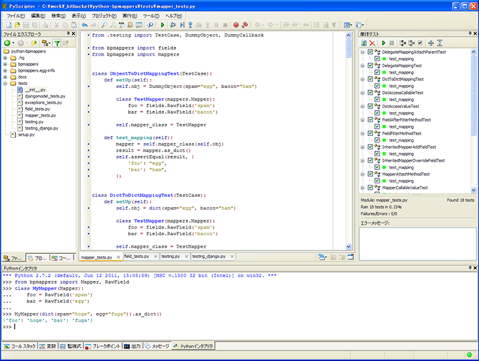
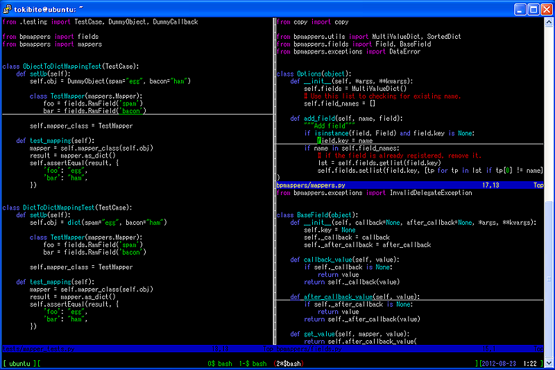

Pythonプログラミング環境の用意
==============================

自分のPCに合ったPythonプログラミング環境を用意します。今回はPython2.7系を使います。

Pythonのインストール
--------------------

Windowsの場合
~~~~~~~~~~~~~

python.orgのダウンロードページから、Windows用のインストーラーをダウンロードしてインストールします。

`Download Python <http://www.python.org/download/>`_

Mac OS Xの場合
~~~~~~~~~~~~~~

Mac OS X(10.7, 10.8)であれば、Python2.7が最初からインストールされています。

それ以外のバージョンを使っている場合は、python.orgからMac用のインストーラーをダウンロードするか、MacPortsなどでインストールすると良いでしょう。

Ubuntuの場合
~~~~~~~~~~~~

Ubuntu12.04, 12.10であれば、最初からPython2.7がインストールされているでしょう。もしインストールされていないならば、aptでpython2.7とpython2.7-devパッケージをインストールしておくと良いでしょう。

開発スタイルについて
--------------------

IDEの利用
~~~~~~~~~

   PyScripter

仮想マシン上での開発
~~~~~~~~~~~~~~~~~~~~

Webアプリケーションの開発などで、別のOSを使用したい場合におすすめのスタイルです。

VMwareやVirtualBoxでLinuxなどを動かし、SSHでログインしてVimやEmacsなどのCUIのテキストエディタで開発します。

   仮想マシンで動作しているUbuntuにSSH(PuTTY)でログインしてVimで開発
