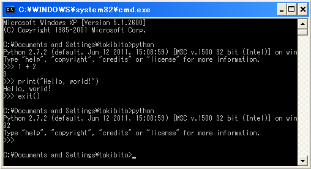

動かしてみよう
==============

ではインストールしたPythonを動かしてみましょう。

対話シェルの起動
----------------

Pythonには、対話的にプログラムを入力、実行できる対話シェルがあります。まずは、対話シェルを使ってみましょう。

Windowsの場合はコマンドプロンプトから、MacOSX、Ubuntuの場合はターミナルから ``python`` と入力してEnter(またはReturn)キーを押します。

   Python対話シェルの起動

正常に起動した場合は、Pythonのバージョンと ``>>>`` という文字(**プロンプト**)が表示されます。

.. note::

   コマンドプロンプトは、WindowsXPの場合はスタートメニュー(Windowsキーを押せば表示されます)の「ファイル名を指定して実行」から ``cmd`` と入力してOKすることで実行されます。
   Windows7の場合は、スタートメニューの検索で ``cmd`` と入力すれば候補に出てくるため、それを選択して実行できます。

.. note::

   MacOSXのターミナルは、「アプリケーション」>「ユーティリティ」>「ターミナル」で起動できます。

プロンプトが表示されている状態になれば、Pythonのプログラムを入力できます。

対話シェルでプログラミングする
------------------------------

まずは「1 + 2」を計算させてみましょう。 ``>>>`` の後ろにカーソル位置がある状態で、 ``1 + 2`` と入力し、Enterキーを押します。

   Python対話シェルで「1 + 2」の計算

計算結果の「3」が画面に表示され、再度プロンプトが表示されます。

次に「Hello, world!」という文字列を画面に表示してみましょう。プロンプトに ``print("Hello, world!")`` と入力してEnterキーを押します。

   Python対話シェルで「Hello, world!」と表示

画面に「Hello, world!」と表示された後、再度プロンプトが表示されます。

このようにPythonシェルは、Pythonのプログラムを逐次入力して実行し、結果を表示できます。

対話シェルを終了するには、 ``exit()`` と入力して実行するか、 ``Ctrl+D`` キーを押します。

   Python対話シェルの終了

次は
----

これでPython対話シェルを使うことができるようになりました。次はこの対話シェル上で、Pythonのいろいろな構文を使ってみましょう。
